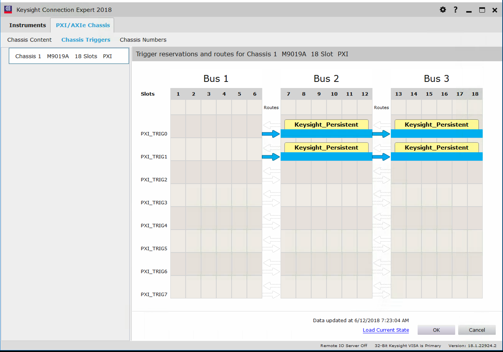

# Keysight PXI HVI Trigger

The driver requires the Windows DLL *"SD1core.dll"* and the Python driver module *"keysightSD1.py"*, which are part of the software package that can be downloaded from the Keysight website.

The driver is compatible with Keysight PXI AWGs and digitizers *M3201, M3202, M3300, M3302, M3100* and *M3102*. However, note that the units must have the *"Enabled HVI programming"* option (HV1) to support triggering.

## Configuration, PXI chassis
The driver uses two PXI backplane ports for triggering.  These ports need to be configured in the *"PXI/AXIe Chassis"*-pane of the *“Keysight Connection Expert”* program.  Please configure the ports **PXI0** and **PXI1** according to the image shown below, and make sure those two trigger ports are not being used for other purposes.

## Configuration, AWG and digitizers
To trigger the AWG and the digitizers, select **"Software / HVI"** as the trig source for the individual units.  The *Keysight PXI HVI Trigger* driver will ensure that the triggers appear syncrounously on all instruments.

